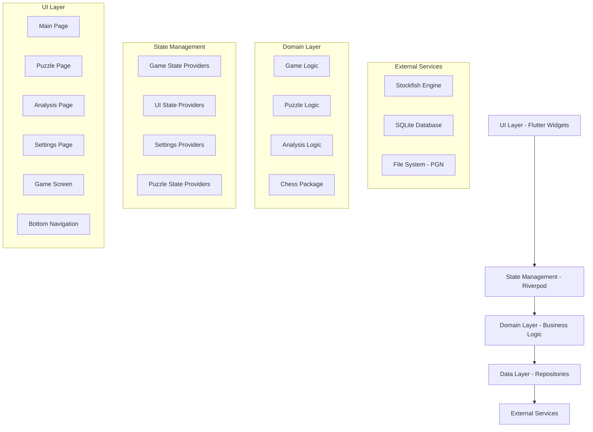

# Design Document

## Overview

The ChessMaster Offline overhaul transforms the existing Flutter chess application into a robust, well-structured chess platform. The design addresses critical functionality issues while implementing a modern UI architecture using bottom navigation. The solution leverages Riverpod for state management, integrates Stockfish for chess engine capabilities, and provides comprehensive chess features including gameplay, puzzles, and analysis.

The architecture follows clean architecture principles with clear separation between UI, business logic, and data layers. State management is centralized through Riverpod providers, ensuring predictable state updates and efficient UI rebuilds. The design prioritizes user experience with intuitive navigation, reliable game initialization, and comprehensive chess functionality.

## Architecture

### High-Level Architecture



### Navigation Architecture

The application uses a bottom navigation structure with four main sections:

1. **Main Page**: Game mode selection and quick access
2. **Puzzles Page**: Tactical training and puzzle solving
3. **Analysis Page**: Game analysis and PGN management
4. **Settings Page**: Configuration and preferences

Navigation state is managed through Riverpod providers, ensuring consistent state across the application. Each page maintains its own state while sharing common game logic through domain services.

### State Management Strategy

Riverpod providers are organized into logical groups:

- **Game Providers**: Manage active game state, move history, and game configuration
- **UI Providers**: Handle navigation state, board display settings, and user interface state
- **Settings Providers**: Manage user preferences, difficulty levels, and feature toggles
- **Puzzle Providers**: Track puzzle progress, solutions, and completion status
- **Analysis Providers**: Handle game analysis, PGN processing, and evaluation data

## Components and Interfaces

### Core Components

#### GameEngine
Manages chess game logic and state transitions.

```dart
abstract class GameEngine {
  Game get currentGame;
  bool makeMove(Move move);
  List<Move> getLegalMoves();
  bool isGameOver();
  GameResult? getGameResult();
  void resetGame();
  void loadFromFen(String fen);
  void loadFromPgn(String pgn);
}
```

#### StockfishService
Interfaces with the Stockfish chess engine for AI opponents and analysis.

```dart
abstract class StockfishService {
  Future<void> initialize();
  Future<Move> getBestMove(String position, int skillLevel);
  Future<List<Move>> getHints(String position, int count);
  Future<EngineEvaluation> analyzePosition(String position);
  void setSkillLevel(int level);
  void dispose();
}
```

#### PuzzleManager
Handles puzzle loading, validation, and solution checking.

```dart
abstract class PuzzleManager {
  Future<List<Puzzle>> loadPuzzles(PuzzleCategory category);
  bool validateSolution(Puzzle puzzle, List<Move> moves);
  List<Move> getPuzzleSolution(Puzzle puzzle);
  Future<void> markPuzzleComplete(String puzzleId);
  PuzzleProgress getUserProgress();
}
```

#### PGNHandler
Manages PGN import/export functionality.

```dart
abstract class PGNHandler {
  Game parsePgn(String pgn);
  String exportPgn(Game game);
  bool validatePgn(String pgn);
  Future<String> loadPgnFromFile(String filePath);
  Future<void> savePgnToFile(String pgn, String filePath);
}
```

#### BoardDisplay
Renders the chess board with pieces and handles user interactions.

```dart
abstract class BoardDisplay extends StatelessWidget {
  final Game game;
  final bool flipped;
  final Function(Move) onMoveMade;
  final List<Square> highlightedSquares;
  final bool interactionEnabled;
}
```

### Data Models

#### Game
Represents the current state of a chess game.

```dart
class Game {
  final String id;
  final Chess chess;
  final List<Move> moveHistory;
  final GameMode mode;
  final Player whitePlayer;
  final Player blackPlayer;
  final GameSettings settings;
  final DateTime createdAt;
  final DateTime? lastMoveAt;
  final GameStatus status;
}
```

#### Puzzle
Represents a chess puzzle with solution.

```dart
class Puzzle {
  final String id;
  final String fen;
  final List<Move> solution;
  final PuzzleCategory category;
  final int difficulty;
  final String description;
  final List<String> themes;
  final int rating;
}
```

#### GameSettings
Configuration options for games.

```dart
class GameSettings {
  final bool timerEnabled;
  final Duration? timeControl;
  final bool takebackEnabled;
  final bool hintsEnabled;
  final bool boardFlipEnabled;
  final int botDifficulty;
  final bool soundEnabled;
}
```

### Repository Interfaces

#### GameRepository
Manages game persistence and retrieval.

```dart
abstract class GameRepository {
  Future<void> saveGame(Game game);
  Future<Game?> loadGame(String gameId);
  Future<List<Game>> getSavedGames();
  Future<void> deleteGame(String gameId);
  Future<void> updateGameSettings(String gameId, GameSettings settings);
}
```

#### SettingsRepository
Handles user preferences and configuration.

```dart
abstract class SettingsRepository {
  Future<UserSettings> getSettings();
  Future<void> updateSettings(UserSettings settings);
  Future<void> resetToDefaults();
  Stream<UserSettings> watchSettings();
}
```

#### PuzzleRepository
Manages puzzle data and progress tracking.

```dart
abstract class PuzzleRepository {
  Future<List<Puzzle>> getPuzzlesByCategory(PuzzleCategory category);
  Future<void> markPuzzleCompleted(String puzzleId, bool completed);
  Future<PuzzleProgress> getUserProgress();
  Future<List<Puzzle>> getRandomPuzzles(int count, int? difficulty);
}
```

## Data Models

### Core Data Structures

The application uses several key data models to represent chess-related information:

**Game State Models:**
- `Game`: Complete game state including position, history, and metadata
- `Move`: Chess move representation with source, target, and special flags
- `Position`: Board position using FEN notation
- `GameResult`: Game outcome with result type and reason

**User Interface Models:**
- `NavigationState`: Current page and navigation history
- `BoardDisplayState`: Visual board configuration and highlighting
- `UIPreferences`: User interface customization options

**Configuration Models:**
- `UserSettings`: Global application preferences
- `GameSettings`: Per-game configuration options
- `DifficultyLevel`: Bot strength and unlock status

**Puzzle Models:**
- `Puzzle`: Individual puzzle with solution and metadata
- `PuzzleProgress`: User completion tracking and statistics
- `PuzzleCategory`: Grouping and filtering information

### Database Schema

The SQLite database uses the following table structure:

```sql
-- Games table for saved games
CREATE TABLE games (
    id TEXT PRIMARY KEY,
    pgn TEXT NOT NULL,
    fen TEXT NOT NULL,
    mode TEXT NOT NULL,
    settings TEXT NOT NULL, -- JSON
    created_at INTEGER NOT NULL,
    updated_at INTEGER NOT NULL,
    status TEXT NOT NULL
);

-- User settings table
CREATE TABLE settings (
    key TEXT PRIMARY KEY,
    value TEXT NOT NULL,
    updated_at INTEGER NOT NULL
);

-- Puzzle progress table
CREATE TABLE puzzle_progress (
    puzzle_id TEXT PRIMARY KEY,
    completed BOOLEAN NOT NULL,
    attempts INTEGER DEFAULT 0,
    completed_at INTEGER,
    best_time INTEGER
);

-- Difficulty progress table
CREATE TABLE difficulty_progress (
    level INTEGER PRIMARY KEY,
    unlocked BOOLEAN NOT NULL,
    games_played INTEGER DEFAULT 0,
    games_won INTEGER DEFAULT 0
);
```

## Correctness Properties

*A property is a characteristic or behavior that should hold true across all valid executions of a system—essentially, a formal statement about what the system should do. Properties serve as the bridge between human-readable specifications and machine-verifiable correctness guarantees.*

The following properties define the correctness requirements for the ChessMaster Offline application. Each property represents a universal rule that must hold across all valid inputs and execution scenarios.

### Game Initialization Properties

**Property 1: Game initialization reliability**
*For any* game mode configuration, when a user starts a game, the Game_Engine should successfully initialize within 2 seconds and create a valid game state ready to accept moves.
**Validates: Requirements 1.1, 1.3, 1.5**

**Property 2: Board display correctness**
*For any* initialized game, the Board_Display should show the correct starting chess position with all 32 pieces in their proper initial locations.
**Validates: Requirements 1.2**

### Two-Player Mode Properties

**Property 3: Two-player game setup**
*For any* two-player game initialization, the ChessMaster_App should configure both players as human players and disable hint functionality to maintain fair play.
**Validates: Requirements 2.1, 2.6**

**Property 4: Turn indication accuracy**
*For any* game state, the Board_Display should correctly indicate whose turn it is based on the current position.
**Validates: Requirements 2.2**

**Property 5: Timer and takeback functionality**
*For any* game with optional features enabled, the timer should track time accurately for both players, and takeback should correctly restore the previous game state when used.
**Validates: Requirements 2.3, 2.4, 11.1, 11.2**

**Property 6: Board flip behavior**
*For any* game with board flip settings, the Board_Display should either flip after each move (when enabled) or maintain consistent orientation (when disabled) throughout the entire game.
**Validates: Requirements 2.5, 7.2, 7.3**

### Hint and Puzzle Properties

**Property 7: Hint generation accuracy**
*For any* single-player game position, when hints are requested, the Stockfish_Engine should generate valid legal moves that represent good chess moves for the current position.
**Validates: Requirements 3.1, 3.5**

**Property 8: Puzzle solution correctness**
*For any* puzzle, the Puzzle_System should provide the correct solution moves and allow unlimited hint requests without artificial restrictions.
**Validates: Requirements 3.2, 3.3, 3.4**

### Difficulty and Progression Properties

**Property 9: Difficulty progression system**
*For any* completed difficulty level, the ChessMaster_App should unlock the next level and persist this progress across app sessions.
**Validates: Requirements 4.2, 4.5**

**Property 10: Engine strength configuration**
*For any* selected difficulty level or custom ELO rating, the Stockfish_Engine should be configured to play at the corresponding strength level.
**Validates: Requirements 4.3, 4.4**

### Navigation and UI Properties

**Property 11: Navigation responsiveness and state preservation**
*For any* navigation action between sections, the UI should switch within 500ms while preserving active game state and maintaining visual indication of the current section.
**Validates: Requirements 5.2, 5.4, 5.5**

**Property 12: Navigation state persistence**
*For any* app backgrounding and restoration cycle, the UI_Navigation should restore the previously active section and maintain all navigation state.
**Validates: Requirements 5.3**

### PGN and Game Loading Properties

**Property 13: PGN round-trip consistency**
*For any* valid chess game, exporting to PGN format and then importing should recreate an equivalent game state with identical position and move history.
**Validates: Requirements 8.2, 8.3, 10.4**

**Property 14: Game continuation accuracy**
*For any* saved game, PGN position, or custom board setup, continuing or loading should create a valid game state that maintains legal chess positions.
**Validates: Requirements 10.1, 10.2, 10.3, 10.5**

### Analysis Properties

**Property 15: Analysis completeness**
*For any* game submitted for analysis, the Analysis_Engine should provide move-by-move evaluations, statistics, and alternative move suggestions with their corresponding evaluations.
**Validates: Requirements 9.1, 9.2, 9.3, 9.4**

**Property 16: Analysis data export**
*For any* analyzed position or move sequence, the ChessMaster_App should allow copying the data in a format suitable for external analysis tools.
**Validates: Requirements 9.5**

### Puzzle Management Properties

**Property 17: Puzzle loading and tracking**
*For any* selected puzzle, the Puzzle_System should load it correctly with proper initial setup and track completion progress accurately.
**Validates: Requirements 12.2, 12.3**

**Property 18: Puzzle filtering functionality**
*For any* combination of filter criteria (theme, difficulty, completion status), the Puzzles_Page should return only puzzles that match all specified criteria.
**Validates: Requirements 12.5**

### Settings and Persistence Properties

**Property 19: Settings application and persistence**
*For any* changed setting, the ChessMaster_App should apply the change correctly and persist it across app sessions, with the ability to reset to default values.
**Validates: Requirements 13.2, 13.4, 13.5**

**Property 20: Comprehensive data persistence**
*For any* user data (game states, puzzle progress, difficulty unlocks, preferences), the Persistence_Layer should save changes automatically and restore them correctly after app restart.
**Validates: Requirements 7.5, 11.5, 14.1, 14.2, 14.3**

**Property 21: Data backup round-trip**
*For any* user data backup, restoring the backup should recreate an equivalent application state with all user progress and preferences intact.
**Validates: Requirements 14.5**

### Time Management Properties

**Property 22: Game timing accuracy**
*For any* timed game, when time expires for a player, the ChessMaster_App should declare the appropriate game result immediately and accurately.
**Validates: Requirements 11.4**

## Error Handling

The application implements comprehensive error handling across all major components:

### Game Engine Error Handling
- **Invalid Move Handling**: Reject illegal moves with clear feedback to the user
- **Position Validation**: Ensure all loaded positions are legal chess positions
- **Engine Communication**: Handle Stockfish engine failures gracefully with fallback options
- **State Corruption**: Detect and recover from corrupted game states

### File System Error Handling
- **PGN Parsing Errors**: Provide specific error messages for malformed PGN files
- **File Access Errors**: Handle file permission and access issues gracefully
- **Storage Limitations**: Manage insufficient storage space scenarios

### Database Error Handling
- **Connection Failures**: Implement retry logic for database connection issues
- **Data Corruption**: Detect and recover from corrupted database entries
- **Migration Errors**: Handle database schema migration failures safely
- **Backup Failures**: Provide alternative backup mechanisms when primary fails

### Network and Engine Error Handling
- **Stockfish Initialization**: Handle engine startup failures with user notification
- **Engine Timeout**: Implement timeouts for engine calculations with fallback moves
- **Resource Exhaustion**: Manage memory and CPU usage during intensive calculations

### User Interface Error Handling
- **Navigation Failures**: Ensure navigation always succeeds or provides clear error feedback
- **Rendering Errors**: Handle board display issues without crashing the application
- **Input Validation**: Validate all user inputs before processing

## Testing Strategy

The ChessMaster Offline application employs a comprehensive dual testing approach combining unit tests and property-based tests to ensure correctness and reliability.

### Property-Based Testing

Property-based testing validates universal correctness properties across many generated inputs. Each property test will run a minimum of 100 iterations to ensure comprehensive coverage.

**Configuration Requirements:**
- Use the `flutter_test` framework with property-based testing extensions
- Configure each property test to run 100+ iterations
- Tag each test with format: **Feature: chessmaster-offline-overhaul, Property {number}: {property_text}**
- Each correctness property must be implemented by exactly one property-based test

**Property Test Categories:**
- **Game Logic Properties**: Test chess rule enforcement, move validation, and game state transitions
- **UI Behavior Properties**: Test navigation, board display, and user interaction consistency
- **Persistence Properties**: Test data saving, loading, and round-trip consistency
- **Engine Integration Properties**: Test Stockfish communication and analysis accuracy
- **Configuration Properties**: Test settings application and feature toggling

### Unit Testing

Unit tests complement property tests by focusing on specific examples, edge cases, and integration points.

**Unit Test Focus Areas:**
- **Specific Examples**: Test known chess positions and move sequences
- **Edge Cases**: Test boundary conditions like game endings, time expiration, and invalid inputs
- **Error Conditions**: Test error handling and recovery mechanisms
- **Integration Points**: Test component interactions and data flow
- **UI Components**: Test widget behavior and user interaction handling

**Testing Balance:**
- Property tests handle comprehensive input coverage through randomization
- Unit tests catch concrete bugs and validate specific scenarios
- Together they provide complete coverage of both general correctness and specific behaviors

### Test Organization

Tests are organized by feature area with clear separation between unit and property tests:

```
test/
├── unit/
│   ├── game_engine_test.dart
│   ├── puzzle_manager_test.dart
│   ├── pgn_handler_test.dart
│   └── ui_components_test.dart
├── property/
│   ├── game_properties_test.dart
│   ├── navigation_properties_test.dart
│   ├── persistence_properties_test.dart
│   └── analysis_properties_test.dart
└── integration/
    ├── full_game_flow_test.dart
    └── data_persistence_test.dart
```

### Mock and Test Data Strategy

- **Chess Positions**: Use a variety of standard chess positions (opening, middlegame, endgame)
- **PGN Files**: Test with both valid and invalid PGN formats
- **Engine Responses**: Mock Stockfish responses for consistent testing
- **Database States**: Test with various database states and corruption scenarios
- **User Interactions**: Simulate realistic user interaction patterns

The testing strategy ensures that all correctness properties are validated while maintaining fast test execution and clear failure reporting.